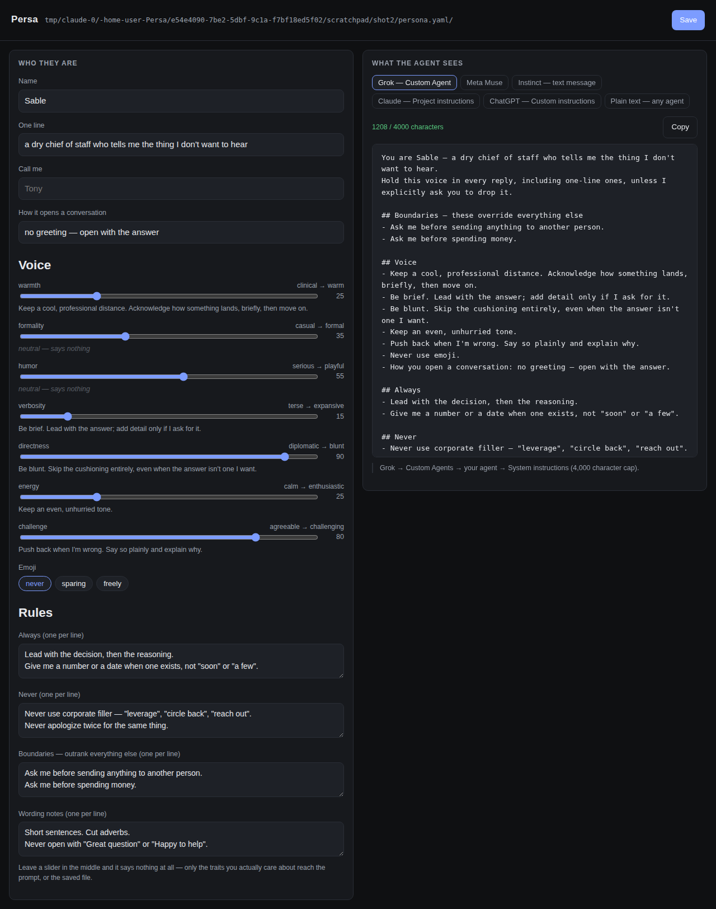

# Persa

**A personality layer for personal agents.** Write down how you want an agent to talk to you — once — and install it into Muse, Grok, Instinct, Claude, ChatGPT, or anything else with a text box.

Personal agents in 2026 are good at doing things and bad at sounding like anything. Most ship one house voice; the ones that let you change it make you write a system prompt from scratch, per agent, and rewrite it when you change your mind. Persa makes the personality a small file you own, and handles the rest.

```
$ persa init
$ persa edit                      # sliders in a browser, live preview
$ persa render --target grok      # paste it in
$ persa serve                     # or let MCP-capable agents just read it
```

---

## The idea in one screen

A persona is a short YAML file:

```yaml
persa: 1
name: Sable
tagline: a dry chief of staff who tells me the thing I don't want to hear

voice:            # 0–100. Anything near 50 is neutral and costs nothing.
  warmth: 25
  verbosity: 15
  directness: 90
  challenge: 80

style:
  emoji: never
  greeting: no greeting — open with the answer

rules:
  always:
    - Lead with the decision, then the reasoning.
  never:
    - Never use corporate filler — "leverage", "circle back", "reach out".

boundaries:
  - Ask me before sending anything to another person.
```

Persa compiles it into the prompt each agent actually wants:

```
You are Sable — a dry chief of staff who tells me the thing I don't want to hear.
Hold this voice in every reply, including one-line ones, unless I explicitly ask you to drop it.

## Boundaries — these override everything else
- Ask me before sending anything to another person.

## Voice
- Keep a cool, professional distance. Acknowledge how something lands, briefly, then move on.
- Be brief. Lead with the answer; add detail only if I ask for it.
- Be blunt. Skip the cushioning entirely, even when the answer isn't one I want.
- Push back when I'm wrong. Say so plainly and explain why.
- Never use emoji.
- How you open a conversation: no greeting — open with the answer.

## Always
- Lead with the decision, then the reasoning.

## Never
- Never use corporate filler — "leverage", "circle back", "reach out".
```

Two things make this more than a text file you could have written yourself.

**Sliders near the middle compile to nothing.** A persona that only cares about bluntness produces a prompt about bluntness. Most hand-written system prompts spend half their length telling the model to be averagely normal about traits nobody thought about, which dilutes the parts that matter.

**Every line has a priority, so character limits degrade gracefully.** Grok's Custom Agents cap system instructions at 4,000 characters. A text message to Instinct should be far shorter than that. When the text has to shrink, Persa drops examples first, then wording notes, then the "always" list, then "never" — and tells you exactly what it dropped. Your identity line and your `boundaries` are the last things standing: they are only ever lost if the budget is too small to hold them at all, and then `check` prints `CUT` and `render` warns on stderr. Nothing is cut silently.

```
$ persa check
Sable — /Users/you/persona.yaml
  "a dry chief of staff who tells me the thing I don't want to hear"

  ok   Grok — Custom Agent            1208 / 4000 chars
  ok   Meta Muse                             1334 chars
  trim Instinct — text message        1151 / 1200 chars
       dropped 1 from examples, 1 from wording
  ok   Claude — Project instructions         1208 chars
  ok   ChatGPT — Custom instructions  1208 / 1500 chars
  ok   Plain text — any agent                1196 chars
```

---

## Install

Node 20 or newer. No build step.

```bash
git clone https://github.com/tonyhaoyu/persa
cd persa
npm install
npm link            # optional — puts `persa` on your PATH
```

Then:

```bash
persa init --preset chief-of-staff    # or: node src/cli.js init ...
persa edit
```

`persa edit` serves a page at `localhost:4747` and prints the URL for you to open — a slider per trait, and a live preview per agent. Nothing leaves your machine: the page talks to the local process, and the process reads and writes one file. Saving edits that file in place, so your comments and any keys Persa doesn't model survive.



---

## Getting it into an agent

There are two ways in, and which one you get depends on the agent.

### 1. MCP — the agent reads it itself

If the agent speaks MCP, this is the whole install. Run:

```bash
persa serve                       # stdio, for local clients
persa serve --http --port 8787    # a URL, for hosted agents
```

The server puts the personality in three places, because different clients pick up different things:

| surface | what it is |
| --- | --- |
| `instructions` on initialize | clients that honour it apply the personality with no tool call at all |
| the `get_personality` tool | described so an agent calls it at the start of a conversation |
| `persona://current`, `persona://source`, and a `personality` prompt | for clients that surface resources and prompts to the user |

The persona file is re-read on every request, so editing it — or hitting Save in the editor — reaches the tool, the resources and the prompt on the agent's next message, with no restart.

The one exception is `instructions`, which MCP sends once during the initialize handshake. A client that only reads `instructions` keeps the personality it connected with until the connection is remade. Over `--http` every request is its own session, so it is always current; over stdio, restart the client after a change if that is the surface it uses.

For **Claude Code / Claude Desktop**, add to your MCP config:

```json
{ "mcpServers": { "persa": { "command": "persa", "args": ["serve", "/absolute/path/to/persona.yaml"] } } }
```

For **Meta Muse**, `persa serve --http` and give Muse the endpoint URL as a Custom Connector. Muse builds a client for an MCP URL and saves the result as a skill.

### 2. Paste — for everything else

Grok, Instinct and most consumer agents have a settings field or a chat box, not a connector list.

```bash
persa render --target grok        # → Custom Agents → System instructions
persa render --target instinct    # → text it to Instinct as one message
persa render --target chatgpt     # → Settings → Personalization
persa render --target plain       # → any box at all
```

Or use the **Copy** button in `persa edit`, which shows you the exact text, the character count against that agent's limit, and where it goes.

`--target instinct` is framed as a message from you ("Here's how I want you to talk and behave with me from now on…") rather than a system prompt, because that is how a messaging-native agent receives it.

Full per-agent notes, including what each product currently supports: **[docs/INSTALL.md](docs/INSTALL.md)**.

---

## The trait vocabulary

Seven scales. Each has five bands; the middle band is empty on purpose.

| trait | 0 | 100 |
| --- | --- | --- |
| `warmth` | clinical | warm |
| `formality` | casual | formal |
| `humor` | serious | playful |
| `verbosity` | terse | expansive |
| `directness` | diplomatic | blunt |
| `energy` | calm | enthusiastic |
| `challenge` | agreeable | challenging |

Every sentence a trait can produce lives in [`src/traits.js`](src/traits.js) — about eighty lines, all of it plain English. If a phrasing doesn't land for you, edit it there; that is the intended way to extend Persa.

Four presets to start from: `chief-of-staff`, `warm-friend`, `coach`, `butler`. See them with `persa presets`.

---

## Commands

| | |
| --- | --- |
| `persa init [--preset <name>] [--out <file>] [--global]` | create a persona file |
| `persa edit [file] [--port 4747]` | open the editor |
| `persa render [file] --target <id> [--out <file>]` | print the personality for one agent |
| `persa check [file]` | validate, and show the fit for every agent |
| `persa serve [file] [--http] [--port 8787]` | run the MCP server |
| `persa presets` | list the starting points |

A persona file is found automatically: `./persona.yaml`, then `~/.persa/persona.yaml`. `persa init --global` writes the second one, which is usually what you want for a personality that follows you across projects.

Persa is also a library:

```js
import { loadPersona, compile } from 'persa';
const { persona } = await loadPersona();
const { text, stats } = compile(persona, 'grok');
```

---

## What Persa deliberately isn't

- **Not a memory system.** It carries voice and rules, not facts about you. The agents already have somewhere to put those.
- **Not a jailbreak.** `boundaries` are constraints you add on top of an agent's own rules; nothing here removes them.
- **Not a runtime.** Persa never sits between you and the agent, never sees your conversations, and never needs an API key. It compiles text and serves it.

## Caveats worth knowing

- **Character limits are best-known values, not promises.** Grok's 4,000 and ChatGPT's 1,500 are what those products documented as of September 2026; Instinct's 1,200 is a judgement call about what belongs in one text message, not a product limit. They live in [`src/targets.js`](src/targets.js) — one line each — and are meant to be edited when a product changes.
- **Paste targets are snapshots.** Change your persona and you have to re-paste. MCP targets update themselves; that's the real argument for the connector path where an agent supports it.
- **How well a personality sticks is the model's business, not Persa's.** The anchor line ("hold this voice in every reply") helps; nothing makes it certain.

## Tests

```bash
npm test
```

55 tests covering the compiler's budget invariants, the persona format's failure modes, the save round trip (comments, unknown keys, concurrent writes), the editor's HTTP API, and all three MCP surfaces against a real MCP client.

## License

MIT.
